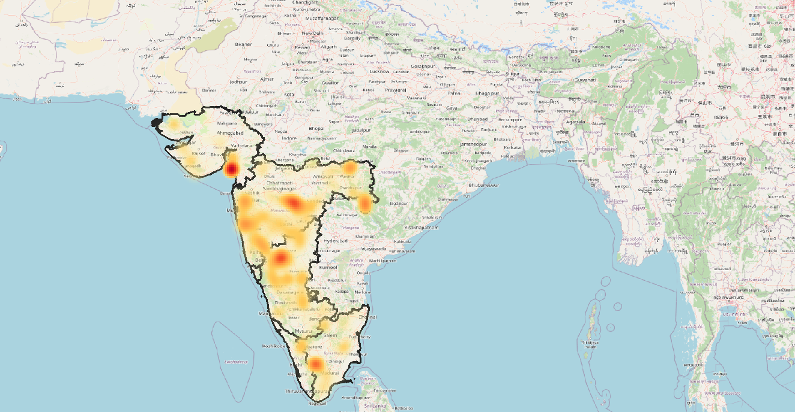
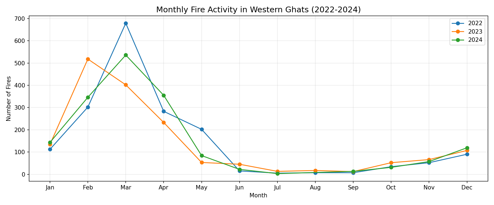
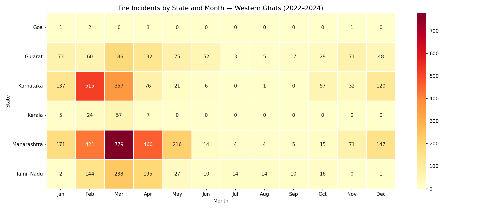

# Western Ghats Forest Fire Analysis (2022–2024)

## Overview
This project maps and analyzes forest fire incidents in the Western Ghats, India, 
using NASA MODIS satellite data from 2022 to 2024.

## What This Project Does
- Downloads and processes 233,000+ NASA fire detection records
- Filters high-confidence fire events (≥80% confidence)
- Clips data to the Western Ghats region
- Visualizes fire density using QGIS heatmap
- Analyzes fire patterns by month and state
- Stores data in PostgreSQL/PostGIS for spatial queries

## Key Findings
- Maharashtra has the highest fire activity (2,307 incidents)
- Peak fire season is February to April, with March being the highest
- Kerala and Goa have the lowest fire occurrence
- Tamil Nadu fires have the highest average intensity
- 
  
  

## Tools Used
- QGIS — spatial analysis and mapping
- Python (GeoPandas, Pandas, Matplotlib) — data processing
- PostgreSQL + PostGIS — spatial database and queries
- NASA FIRMS MODIS — satellite fire data

## Data Sources
- NASA FIRMS: firms.modaps.eosdis.nasa.gov
- GADM Administrative Boundaries: gadm.org

## Author
Salwin | GIS Analyst | TUM Munich Graduate,
Kerala, India
